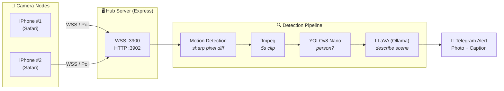
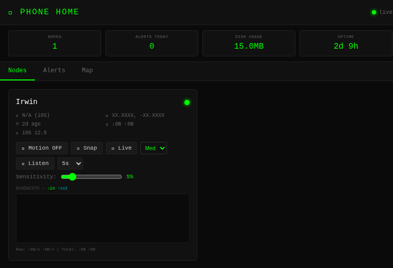
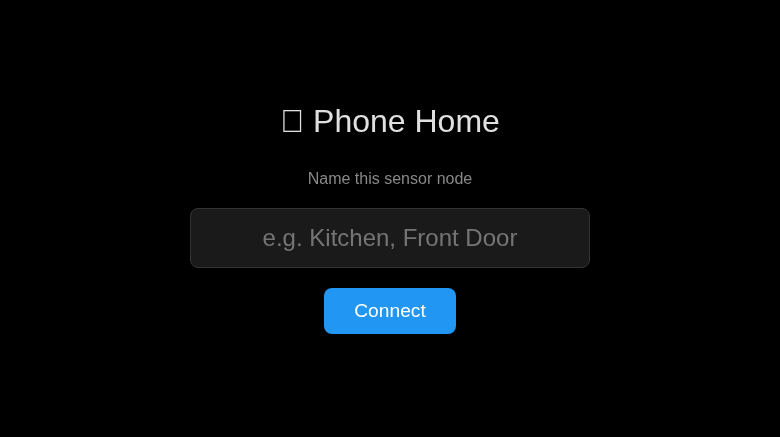

# 📡 Phone Home

**Turn old iPhones into AI-powered security cameras on your LAN.**

Phone Home is a self-hosted surveillance system that uses old iPhones as camera nodes, connected via WebSocket to a central hub. When motion is detected, the system records a clip, runs YOLOv8 person detection, describes the scene with LLaVA vision AI, and sends a Telegram alert with a thumbnail — all on your local network with no cloud dependency.

## Features

- **Motion detection** — frame-differencing on the hub, with configurable sensitivity per node
- **5-second clip recording** — captures JPEG frames and stitches them into MP4 via ffmpeg
- **YOLOv8 Nano person filtering** — only alerts when a person is detected (not pets, shadows, etc.)
- **LLaVA vision analysis** — describes what's happening in the scene ("Person walking through kitchen")
- **Telegram alerts** — photo + description sent to your phone when a person is detected
- **Multi-node** — connect as many old iPhones as you want
- **Admin dashboard** — real-time node status, alerts, bandwidth monitoring
- **Polling fallback** — supports iOS 12+ devices that can't do WebSocket over self-signed HTTPS
- **Tamper detection** — accelerometer-based alerts if a phone is moved
- **Audio capture** — on-demand audio recording from any node
- **Location tracking** — optional GPS from each node

## Architecture



### Detection Pipeline

1. **Motion** — Hub compares incoming JPEG frames via pixel differencing (configurable threshold)
2. **Clip** — On motion trigger, records 5 seconds of frames → stitches to MP4 with ffmpeg
3. **YOLO** — Best frame from clip is run through YOLOv8 Nano for person detection
4. **LLaVA** — If person detected, frame is sent to Ollama's LLaVA model for scene description
5. **Alert** — Telegram message with thumbnail, person count, motion %, and description

## Requirements

- **Node.js** 18+
- **Python 3.10+** (for YOLO person detection)
- **ffmpeg** (for clip encoding)
- **Ollama** with `llava:7b` model (for vision analysis)
- Old iPhones running **iOS 12+** with Safari

## Quick Start

```bash
git clone https://github.com/kraftwerkur/phone-home.git
cd phone-home

# Run setup (generates certs, installs deps, creates .env)
./setup.sh

# Pull the LLaVA model
ollama pull llava:7b

# (Optional) Configure Telegram alerts
# Edit .env and set TELEGRAM_BOT_TOKEN and TELEGRAM_CHAT_ID

# Start the hub
cd hub && npm start
```

Then on each iPhone:
1. Open `https://<hub-ip>:3900/cert` in Safari to install the self-signed CA cert
2. Go to **Settings → General → About → Certificate Trust Settings** and enable trust
3. Open `https://<hub-ip>:3900` in Safari
4. Give the node a name and grant camera permissions

## Configuration

All configuration is via environment variables (see `.env.example`):

| Variable | Default | Description |
|----------|---------|-------------|
| `PORT` | `3900` | HTTPS port for camera nodes and web client |
| `HTTP_PORT` | `3902` | HTTP port for local API access |
| `TELEGRAM_BOT_TOKEN` | *(empty)* | Telegram bot token (optional) |
| `TELEGRAM_CHAT_ID` | *(empty)* | Telegram chat ID for alerts (optional) |
| `PYTHON_BIN` | `./venv/bin/python` | Path to Python binary with ultralytics |

## API Reference

All endpoints are on the HTTP port (default 3902).

| Endpoint | Method | Description |
|----------|--------|-------------|
| `/api/nodes` | GET | List connected nodes with status |
| `/api/nodes/:id/snap` | POST | Request a photo from a node |
| `/api/nodes/:id/listen` | POST | Request audio clip (`{duration: 5}`) |
| `/api/nodes/:id/motion` | POST | Enable/disable motion detection (`{enabled: true}`) |
| `/api/nodes/:id/threshold` | POST | Set motion threshold (`{threshold: 5}`) |
| `/api/nodes/:id/quality` | POST | Set video quality (`{quality: "low\|medium\|high"}`) |
| `/api/nodes/:id/bandwidth` | GET | Bandwidth history (last 30 min) |
| `/api/snapshots/:id/latest` | GET | Get latest snapshot image |
| `/api/alerts` | GET | Get recent motion alerts |
| `/api/alerts` | DELETE | Clear all alerts |
| `/api/stats` | GET | System stats (node count, alerts today, disk usage) |
| `/api/clips/:nodeId/:filename` | GET | Serve a clip video |
| `/api/thumbs/:nodeId/:filename` | GET | Serve an alert thumbnail |

## Screenshots

### Admin Dashboard
Real-time node monitoring with bandwidth graphs, per-node controls, motion sensitivity, and system stats.



### Camera Node (Client)
The web client served to each iPhone — name the node and connect to start streaming.



## The Polling Fallback Story

Older iOS devices (12–14) can't establish WebSocket connections over self-signed HTTPS certificates — Safari silently refuses the `wss://` upgrade. Rather than requiring a real CA cert or dropping support for older devices, Phone Home implements a full HTTP polling fallback:

- Nodes register via `POST /api/poll/register` and receive an ID
- They poll for commands via `POST /api/poll/:id/poll`
- Snapshots are uploaded via `POST /api/poll/:id/snap`

The polling client is the same web page — it auto-detects when WebSocket fails and falls back to polling. This means that old iPhone 6 in your junk drawer can still be a security camera.

## Project Structure

```
phone-home/
├── hub/                # Node.js hub server
│   ├── server.js       # Main server (Express + WebSocket)
│   ├── certs/          # Self-signed certs (generated by setup.sh)
│   └── package.json
├── client/             # Web client (served to iPhones)
│   └── index.html
├── admin/              # Admin dashboard
│   └── index.html
├── detect_person.py    # YOLOv8 Nano person detection script
├── setup.sh            # One-command setup
├── .env.example        # Environment variable template
└── data/               # Runtime data (gitignored)
    ├── snapshots/
    ├── clips/
    ├── audio/
    └── alerts/
```

## License

MIT — see [LICENSE](LICENSE).
